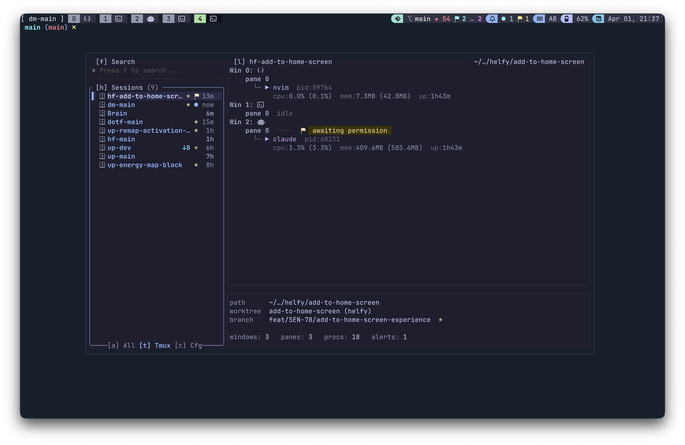
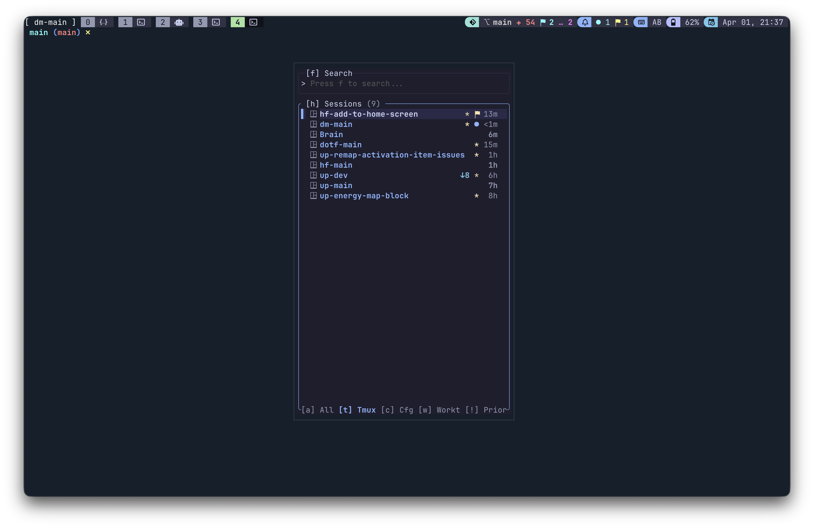

# demux

demux is a terminal dashboard built for tmux power users. It shows you
what is running across all your sessions: processes, git branches, ports,
and alerts, all without leaving the terminal.

## Features

- Live sidebar of tmux sessions with git status (branch, dirty, ahead/behind)
- Process list per session: CPU, memory, uptime, listening port, working directory
- Alert system: set info/warn/error alerts on any window or pane
- Fuzzy search across sessions, windows, and processes
- Compact popup mode for use in a tmux split or popup
- Scriptable CLI: list sessions, procs, ports, alerts in text/table/json
- Tmux status bar integration via `demux status`
- Auto-clears alerts on pane focus via tmux hooks
- Fully themeable with a Catppuccin Mocha default
- Session config: define sessions with groups, labels, icons, and window templates

## Install

**Homebrew (macOS/Linux)**

    brew tap rtalexk/demux
    brew install demux

**Go**

    go install github.com/rtalexk/demux@latest

## Quick Start

Launch the TUI:

    demux

Launch in compact mode (useful as a tmux popup):

    demux --compact

Set `DEMUX_POPUP=1` to make demux quit automatically after switching to a
session. Pair this with a tmux popup binding:

    bind-key D display-popup -w 40 -h 80% -E "DEMUX_POPUP=1 demux --compact"

Start with the search input focused:

    demux --search

Generate a default config file:

    demux config init > ~/.config/demux/demux.toml

## Key Bindings

| Key | Action |
|-----|--------|
| `j` / `k` | Move down / up |
| `g` / `G` | Jump to top / bottom |
| `J` / `K` | Jump down / up (large step) |
| `h` | Focus sidebar |
| `l` | Focus process list |
| `enter` | Switch to session |
| `o` | Open / attach to session |
| `y` | Yank session name to clipboard |
| `x` | Kill selected process |
| `r` | Restart selected process |
| `L` | View process log |
| `R` | Force refresh |
| `t` | Filter: tmux sessions only |
| `a` | Filter: all sessions |
| `c` | Filter: config sessions only |
| `w` | Filter: worktree sessions only |
| `!` | Filter: sessions with alerts |
| `tab` / `shift+tab` | Cycle focus |
| `[` / `]` | Collapse / expand process group |
| `{` / `}` | Collapse / expand all groups |
| `?` | Toggle help overlay |
| `q` / `ctrl+c` | Quit |

Press `?` inside the TUI for the full interactive reference.

## Configuration

The default config path is `~/.config/demux/demux.toml`. Generate a
commented starting point with:

    demux config init > ~/.config/demux/demux.toml

The generated file is fully commented and covers all available options.

### Sessions

Define sessions in `~/.config/demux/sessions.toml`. Sensitive entries can
go in `~/.config/demux/private.toml`, which is gitignore-friendly.

Add a session from the command line:

    demux session config-add --name myproject --path ~/code/myproject

Or write it by hand:

    [[session]]
    name     = "myproject"          # must match the tmux session name
    path     = "~/code/myproject"   # root directory of the session
    group    = "work"               # optional group label in the sidebar
    labels   = ["rust", "api"]      # optional tags
    icon     = "⚙︎"                  # optional icon shown in the sidebar
    worktree = false                # true if the path is a git worktree
    windows  = ["editor", "term"]   # window templates to create on launch

### Window Templates

Window templates let you define reusable tmux window layouts. They live in
`sessions.toml` alongside your session entries.

    [[window_templates]]
    id               = "editor"         # referenced by [[session]].windows
    name             = "editor"         # tmux window name
    after_create_cmd = "nvim ."         # command to run after the window is created

    [[window_templates]]
    id               = "term"
    name             = "terminal"
    after_create_cmd = ""

    # inherit from another template and override fields
    [[window_templates]]
    id   = "server"
    from = "term"                       # copies name and after_create_cmd from "term"
    name = "server"
    after_create_cmd = "cargo run"

Create the windows for a session:

    demux session create-windows --session myproject --windows editor,term,server

### Path Aliases

Shorten verbose paths displayed in the TUI. The longest matching prefix wins.

Before:

    /Users/alex/code/myproject/src

After (with the alias below):

    ~/code/myproject/src

Config:

    [[path_aliases]]
    prefix  = "$HOME"   # supports environment variables
    replace = "~"

### Theme

demux ships with a Catppuccin Mocha theme. All colors are configurable
under the `[theme]` section of `demux.toml`.

## Hooks

### tmux

demux can automatically clear alerts when you navigate between panes,
windows, or sessions. Print the hook configuration with:

    demux hooks init --agent tmux

> **Note:** The `--agent` flag will be renamed in a future version.

Then paste the output into `~/.tmux.conf` and reload:

    tmux source ~/.tmux.conf

### Tmux Status Bar

Add a live alert summary to your tmux status bar:

    set -g status-right "#(demux status)"

This outputs a colored count of active alerts (info, warn, error). When
there are no alerts it shows a green indicator.

## CLI Reference

    demux                          # launch the TUI
    demux --compact                # compact mode (sidebar + search only)
    demux --search                 # start with search focused
    demux --format text|table|json # output format for CLI commands
    demux --log-level off|error|warn|info|debug

    demux session list             # list all tmux sessions
    demux session list --git       # include git columns
    demux session list --git-only  # session + git columns only
    demux session config-add       --name <n> --path 
 [--group <g>] [--labels <l>] [--worktree] [--private]
    demux session config-get       --name <n>
    demux session config-remove    --name <n> [--private]
    demux session create-windows   --session <n> --windows <ids>

    demux windows --session <n>    # list windows in a session
    demux windows --session <n> --git

    demux procs                    # list processes across all sessions
    demux procs --session <n>      # filter to a session
    demux procs --window <n:idx>   # filter to a window
    demux procs --git              # include git column

    demux ports                    # list all TCP listening ports

    demux alert list               # list active alerts
    demux alert set   --target <session:window[.pane]> --reason <text> [--level info|warn|error]
    demux alert remove --target <session:window[.pane]>

    demux query <term>             # fuzzy search sessions, windows, processes
    demux query <term> --session-name-only  # output session names only (for fzf)

    demux status                   # alert summary for tmux status bar
    demux status --format json

    demux event pane_focus         # clear alerts for the focused pane (used by hooks)

    demux config init              # print default config to stdout
    demux hooks init --agent tmux|claude

## Roadmap

- **Sticky sidebar mode:** A persistent sidebar that retains its position
  and selection as you switch between sessions.
- **Richer ports view:** Expand the `ports` command with process trees,
  protocol details, and per-session grouping.
- **Richer session rows:** Show more at a glance on each sidebar row.
- **AI coding agent integration:** Surface the state of running AI agents
  directly in the TUI.
- **Live config reload:** Pick up changes to `demux.toml` without
  restarting.
- **Per-pane environment variables:** Inspect the environment of any pane
  from the process list.

## Contributing

Open an issue to report a bug or propose a feature. Pull requests are not
being accepted yet; the project is still in its early stages. Starting a
discussion first is the best way to get something considered.

## License

MIT. See [LICENSE](LICENSE).
