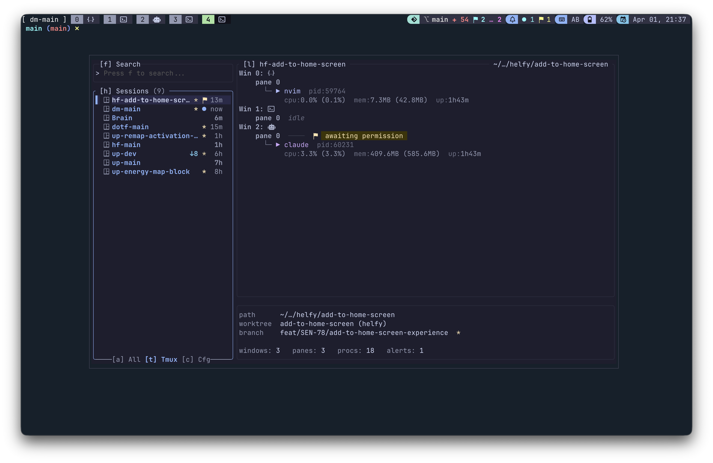
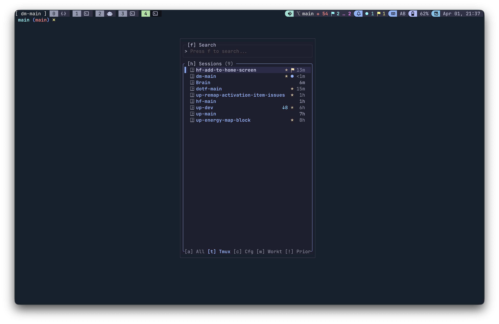

# demux

**demux** is a session manager and dashboard for tmux. It allows you to move fast across tmux sessions, shows you what is running across all your sessions: processes, git branches, ports, all without leaving the terminal.

Track what your tools are doing across every pane: working, waiting, done, or failed.





> [!CAUTION]
> **Breaking change:** The alert system has been replaced by the state system. `demux alert` commands, `[alerts]` config, and `color_alert_*` theme tokens no longer exist. See the [migration guide](docs/migration/state-system.md) before upgrading from v0.3.0.

## Motivation

**TL;DR:** My entire workflow lives in the terminal. Each tmux session is a project or worktree. In this new era of agentic programming, nearly every session has a Claude instance running tasks for me, and keeping track of all of them became a real problem. demux is the result.

<details>

<summary>The longer, less exciting story</summary>

For over a year I relied on [Sesh](https://github.com/joshmedeski/sesh). Simply fantastic. It covered everything I needed: fast, frictionless navigation between tmux sessions.

Then everything changed when the agentic programming nation attacked. I adapted, leaned into AI for day-to-day work, and started running more tasks in parallel. But parallel work and ADHD are a terrible combination. I kept leaving Claude waiting on a response for hours at a time. Deeply inefficient.

I looked at a few tools ([Conductor](https://www.conductor.build/), [LazyAgent](https://github.com/illegalstudio/lazyagent), [opensessions](https://github.com/ataraxy-labs/opensessions)), but none of them fit my setup or the way I work: fast session switching via Sesh, plus visibility into which session actually needs my attention, without UX disruption or UI bloating.

I had already extended my personal CLI with commands to [manage git worktrees](https://github.com/rtalexk/dotfiles/tree/main/alx/cmd/worktree). I only discovered [Worktrunk](https://github.com/max-sixty/worktrunk) after the fact, and while my implementation is limited, it does what I need. I may switch eventually, but not any time soon.

_opensessions_ came closest to what I was looking for, and its premise overlaps significantly with mine. But Sesh's UX is too deeply wired into my muscle memory, and I was already mid-implementation anyway. What I needed was Sesh, but with state tracking and process information.

Why not just configure Claude to send OS-level notifications? I hate notifications. Almost all of them are blocked on my phone, and only a handful are allowed on the desktop. They're disorganized, and they interrupt flow. What I actually want is: _tell me you need attention, and I'll get to you when I'm free._

### How demux fits into my workflow

When I pick up a ticket (Linear or GitHub issue):

```bash
alx wt add <name> [branch]
# alx wt add user-signup feat/PROJ-32/add-user-signup
```

This assumes a repository structure like:

```
./my-node-app
├── project.toml
├── .env
├── main/
├── dev/
├── feature-1/
├── feature-2/
└── user-signup/
```

Where `project.toml` looks like:

```toml
alias = "rem"
on_create = "npm install"
copy_files = [".env"]

[demux]
windows = ["editor", "shell"]
```

`alx wt add` reads that file, creates a worktree in the repo, spins up a tmux session named `<alias>-<worktree>` (e.g. `rem-user-signup`), copies any files listed in `copy_files`, runs the `on_create` command, and registers the session in demux's `private.toml` forwarding the `[demux]` block.

Claude knows this workflow. It uses my CLI to take tickets independently with worktrees, opens PRs, and notifies me via `demux state set ...`.

demux will keep evolving as my workflow does. tmux and Neovim are constants ((Neo)?Vim for 15+ years, tmux for 5+). I don't expect to replace them any time soon.

</details>

## Features

- Jump fast across tmux sessions
- Live sidebar with git status (branch, dirty, ahead/behind) and last-seen age
- Process list per session: CPU, memory, uptime, listening port, working directory
- State system: track tool lifecycle (working, waiting, done, error, flagged) across any pane
- Fuzzy search across sessions, windows, and processes
- Compact popup mode for use in a tmux split or popup
- Scriptable CLI: list sessions, procs, ports, and states in text/table/json
- Tmux status bar integration via `demux status`
- Auto-clears state on pane focus via tmux hooks
- Fully themeable with a Catppuccin Mocha default
- Session config: define sessions with groups, labels, icons, and window templates

## Install

**Homebrew (macOS/Linux)**

```bash
brew install rtalexk/demux/demux
```

**Go**

```bash
go install github.com/rtalexk/demux@latest
```

## Upgrade

**Homebrew**

```bash
brew upgrade rtalexk/demux/demux
```

**Go**

```bash
go install github.com/rtalexk/demux@latest
```

## Quick Start

Launch the TUI:

```bash
demux
```

Launch in compact mode (useful as a tmux popup):

```bash
demux --compact
```

Start with the search input focused:

```bash
demux --search
```

<details>

<summary>Using demux as a tmux popup</summary>

Set `DEMUX_POPUP=1` to make demux quit automatically after switching to a session. Pair this with a tmux popup binding:

```tmux
# Full mode popup (80% width)
bind-key K display-popup -E -w 80% -h 80% "DEMUX_POPUP=1 demux"

# Compact mode popup (30% width, sidebar only)
bind-key k display-popup -E -w 30% -h 80% "DEMUX_POPUP=1 demux --compact"
```

Paste these lines into `~/.tmux.conf` and reload:

```bash
tmux source ~/.tmux.conf
```

</details>

## TUI

The TUI has three panels:

- **Sidebar** — lists sessions with state indicators, git status, and last-seen age.
- **Process list** — shows processes for the selected session, grouped by pane.
- **Detail panel** — contextual info for the selected session, window, or process.

In compact mode (`--compact` or `mode = "compact"` in config) only the sidebar and search box are shown, making it suitable for narrow tmux popups.

<details>

<summary>Key bindings</summary>

**Global**

| Key                 | Action                       |
| ------------------- | ---------------------------- |
| `h` / `l`           | Focus sidebar / process list |
| `Tab` / `Shift+Tab` | Cycle focus (wraps)          |
| `f`                 | Focus search input / filter  |
| `Ctrl+u`            | Clear search filter          |
| `R`                 | Force refresh                |
| `?`                 | Toggle help overlay          |
| `q` / `Ctrl+c`      | Quit                         |

**Navigation** (works in sidebar and process list)

| Key                 | Action                |
| ------------------- | --------------------- |
| `j` / `k`           | Move down / up        |
| `Ctrl+j` / `Ctrl+n` | Move down (alternate) |
| `Ctrl+k` / `Ctrl+p` | Move up (alternate)   |
| `g` / `G`           | Jump to top / bottom  |

**Sidebar**

| Key            | Action                                                     |
| -------------- | ---------------------------------------------------------- |
| `Enter`        | Attach to session                                          |
| `o` / `Ctrl+o` | Attach to session / highest-priority state window          |
| `Esc`          | Back to session level (from window view)                   |
| `y`            | Open yank menu (copy session name to clipboard)            |
| `F`            | Flag the selected session                                  |
| `P`            | Toggle watch — mark/unmark session as actively in progress |
| `X`            | Clear state for the selected session                       |

**Sidebar filters**

| Key | Filter                                               |
| --- | ---------------------------------------------------- |
| `t` | Tmux sessions only (default)                         |
| `a` | All sessions (tmux + config)                         |
| `c` | Config sessions only                                 |
| `w` | Sessions in current worktree                         |
| `!` | Sessions needing attention (error, flagged, waiting) |
| `@` | Watched sessions only                                |

**Process list**

| Key            | Action                             |
| -------------- | ---------------------------------- |
| `J` / `K`      | Jump to next / previous pane group |
| `Enter`        | Toggle expand / collapse group     |
| `o` / `Ctrl+o` | Attach to selected pane            |
| `]` / `[`      | Expand / collapse group            |
| `}` / `{`      | Expand / collapse all groups       |
| `x`            | Kill selected process              |
| `r`            | Restart selected process           |
| `L`            | Open process log popup             |

Press `?` inside the TUI for the full interactive reference.

</details>

<details>

<summary>Sidebar filters and sort order</summary>

The sidebar can show different sets of sessions depending on the active filter:

- **tmux (`t`)** — only live tmux sessions (default).
- **all (`a`)** — live tmux sessions plus sessions defined in config that are not currently running.
- **config (`c`)** — config-only sessions (defined but not currently live).
- **worktree (`w`)** — sessions whose path belongs to the same git worktree as the current session.
- **attention (`!`)** — sessions with `error`, `flagged`, or `waiting` states. Configure whether `working` is included with `tui.attention_filter_include_working`.
- **watch (`@`)** — sessions you have marked as actively being worked on (see Watch Sessions below).

Sessions are sorted by priority, then last-seen time, then alphabetically. Change the order in `demux.toml`:

```toml
[sidebar]
sort = ["priority", "last_seen", "alphabetical"]
```

When you open the TUI, the sidebar can focus different rows based on `focus_on_open`:

- `current_session` — select the currently active tmux session.
- `first_session` — select the first row.
- `state_session` — select the first session that has a visible state.

</details>

## State System

demux tracks what tools are doing in each pane. A state has:

- **target** — which pane/window/session is affected, in `session:window.pane` format.
- **state** — one of `working`, `waiting`, `done`, `error`, or `flagged`.
- **tool** — optional name of the tool that set the state (e.g. `claude`).
- **message** — optional human-readable detail.

States are stored in a local SQLite database and reflected in the sidebar and status bar in near-real time.

<details>

<summary>Setting and clearing states</summary>

```bash
# Mark a pane as working (use the stable pane ID: %N)
demux state set --target-id %5 --state working --tool claude --message "on it"

# Mark as done
demux state set --target-id %5 --state done --tool claude --message "task complete"

# Clear a state (return to idle)
demux state clear --target-id %5

# Clear a flagged state (requires --yes)
demux state clear --target-id %5 --yes

# List all active states
demux state ls

# Filter by state or tool
demux state ls --state waiting
demux state ls --tool claude
```

**Conditional writes**

Use `--if-state` to only update if the current state matches:

```bash
# Only set to idle if currently done (avoids overwriting active states)
demux state set --target-id %5 --state idle --if-state done
```

**Write lock**

When a tool sets an active state (`working` or `waiting`), that pane is locked. Another tool cannot overwrite it unless `--force` is passed:

```bash
demux state set --target-id %5 --state working --tool other --force
```

> [!WARNING]
> `--force` bypasses all lock rules, including the `flagged` state which is user-owned. Avoid using it in automated hooks — it can silently overwrite bookmarks you set manually.

**Flagging**

The `flagged` state is a user-facing bookmark. It can only be set with `--source user`:

```bash
demux state set --target-id %5 --state flagged --source user --message "review this"
```

In the TUI, press `F` on a target to flag it directly. Press `F` again to unflag it.

**Watch Sessions**

Press `P` to mark a session as "watched" — a signal that you are actively working on it. Watched sessions display a configurable icon (default: `·`) flush against the last-seen indicator in the sidebar. The watch set is persistent across restarts and independent of the tool state system — watching a session does not affect its tool states. Press `@` to filter the sidebar to watched sessions only. Configure the icon and color with `icon_watch` and `color_watch` in the `[theme]` section.

**Session Checklists**

Each session can have a persistent TODO checklist. Press `C` to toggle the right panel between the normal pane/process view and the session's checklist.

Sessions with at least one open (unchecked) item display a configurable icon (default: `☑︎`) immediately to the left of the last-seen indicator in the sidebar.

Keybindings active in checklist mode:

| Key         | Action                                                |
| ----------- | ----------------------------------------------------- |
| `j` / `k`   | Move cursor down / up                                 |
| `g` / `G`   | Jump to top / bottom                                  |
| `a`         | Add a new item (type and press Enter)                 |
| `e`         | Edit the focused item inline                          |
| `x`         | Toggle checked / unchecked                            |
| `d`         | Delete the focused item (prompts confirmation)        |
| `E`         | Open the full checklist in `$EDITOR` (fallback: `vi`) |
| `C` / `Esc` | Exit checklist mode                                   |

Checklists are stored in the demux SQLite database and persist across restarts. When a session is removed with `demux session remove`, its checklist is deleted automatically.

If a session is destroyed outside of demux (e.g. `tmux kill-session`), its checklist becomes orphaned. Use the CLI to manage orphans:

```
demux item list-orphaned              # list sessions with orphaned items
demux item clear-orphaned             # clear all orphaned items (prompts)
demux item clear-orphaned --name foo  # clear a specific session's orphaned items
```

Configure the indicator icon and color in the `[theme]` section:

```toml
[theme]
icon_todo  = "☑︎"    # shown when session has open TODO items
color_todo = ""      # icon color (empty = default text color)
icon_note  = "✏"    # shown when session has notes but no open TODOs
```

</details>

<details>

<summary>State values and priority</summary>

| State     | Meaning                             | Priority |
| --------- | ----------------------------------- | -------- |
| `waiting` | Tool is paused, expecting input     | Highest  |
| `error`   | Tool failed or encountered an error | High     |
| `done`    | Tool completed successfully         | Medium   |
| `flagged` | User-set bookmark (needs attention) | Low      |
| `working` | Tool is actively running            | Lower    |
| _(idle)_  | No active state                     | None     |

When multiple panes in a session have states, the highest-priority one is shown in the sidebar.

**Done → idle visual transition**

After a configurable timeout (default 60 seconds), a `done` state is rendered as `idle` in the TUI. This prevents `done` badges from accumulating when you're busy and lets you see at a glance that a tool finished a while ago versus just now.

> [!NOTE]
> The DB record is not changed. Navigating to the pane or pressing `X` still clears it normally — the idle rendering is purely visual.

Configure the threshold in `demux.toml`:

```toml
[tui]
done_idle_after_secs = 60   # 0 to disable; done stays visible until manually cleared
```

</details>

## Configuration

The default config path is `~/.config/demux/demux.toml`. Generate a commented starting point with:

```bash
demux config init > ~/.config/demux/demux.toml
```

<details>

<summary>All configuration options</summary>

```toml
# How often to refresh session/process data (milliseconds)
refresh_interval_ms = 3000

# Sessions to hide from the sidebar
ignored_sessions = []

# Processes to hide from the process list (children are promoted up)
ignored_processes = ["zsh", "bash", "fish", "sh", "dash", "nu", "pwsh"]

# Default output format for CLI commands: text | table | json
default_format = "text"

# UI layout mode: full | compact
mode = "full"

# Path prefix aliases — shorten verbose absolute paths in the TUI.
# Longest matching prefix wins. Supports environment variables.
# [[path_aliases]]
# prefix  = "$HOME"
# replace = "~"

[sidebar]
width = 35                          # sidebar width in columns
show_last_seen = true               # show last-seen age on each live session row
active_session_icon = "►"          # icon shown next to the currently attached tmux session
focus_on_open = "current_session"   # current_session | first_session | state_session
focus_search_on_open = false        # start with cursor in the search input
default_filter = "t"                # t | a | c | w | !
sort = ["priority", "last_seen", "alphabetical"]
switch_focus = "default"            # default | newest | oldest
session_view = "row"                # row | card  (default for both modes; card = two-row layout)
session_view_mode_compact = ""      # row | card  (override session_view in compact mode; "" = inherit)
session_view_mode_full = ""         # row | card  (override session_view in full mode; "" = inherit)
card_separator = "blank"            # none | blank | rule  (separator row between cards in card view)

[process_list]
path_right_align = false            # right-align pane CWD paths

[tui]
attention_filter_include_working = false  # include working sessions in the ! filter
flag_default_message = "Come back"        # default message when flagging a session
done_idle_after_secs = 60                 # render done as idle after N seconds (0 = disabled)

[log]
level = "warn"                      # off | error | warn | info | debug
                                    # log file: ~/.local/share/demux/demux.log

[status_bar]
show = true

[git]
enabled = true
show_spinner = false
timeout_ms = 500
on_timeout = "cached"               # cached | hide | error
fallback_display = "—"
error_display = "git err"

[git.pr]
enabled = false                     # show PR info in the detail panel
```

</details>

### Sidebar process labels

Render a small text label on each sidebar row to surface what kind of process is running in that session. Useful when you want to see at a glance which sessions hold a Claude agent, a dev server, a Python virtualenv, etc.

Configure via the `[[sidebar.processes]]` array in `demux.toml`:

```toml
[[sidebar.processes]]
match = "claude*"
label = "🤖"

[[sidebar.processes]]
match = "node*"
label = "node"

[[sidebar.processes]]
match = ["python*", "uvicorn", "uv"]
label = "py"
fg = "#fee685"
bg = "#3b3000"
```

**Fields**

- `match`: a glob pattern (Go [`filepath.Match`](https://pkg.go.dev/path/filepath#Match) syntax, case-insensitive), or an array of globs that share the same `label`/`fg`/`bg`. Matched against the process name and any whitespace-separated token of its full command line, including the basename of each token.
- `label`: the text rendered in the sidebar when the pattern matches.
- `fg`, `bg` (optional): per-entry hex colors. When unset, fall back to the theme defaults `color_proc_label_fg` and `color_proc_label_bg`.

**Match rules**

- Each pane is inspected at level 0 (the pane root) first. If the root matches a pattern, the result wins for that pane and child processes are skipped.
- If the root has no match, level 1 (direct children of the pane root) is inspected. The first child that matches a pattern wins.
- Deeper descendants are never inspected.
- Across a session's panes, the label with the highest occurrence count wins. On a count tie, the entry declared first in the array wins.
- Sessions with zero matches show no proc label.

**Render position**

The proc label is the leftmost indicator on the sidebar row. Indicator order is `[proc] [git] [state] [todo] [last-seen] [watch]`.

**Compact mode**

The label renders in both full and compact mode. In compact mode the proc snapshot is fetched only when at least one `[[sidebar.processes]]` entry is configured; otherwise compact mode keeps its current zero-cost behavior.

<details>

<summary>Theme customization</summary>

All colors use hex values. The default is Catppuccin Mocha.

```toml
[theme]
# Structure & chrome
color_bg       = "#0d0d14"
color_surface  = "#13131a"
color_raised   = "#1e1e2e"
color_selected = "#2a2a4a"
color_border   = "#313244"

# Text hierarchy
color_fg_primary = "#cdd6f4"
color_fg_subtext = "#a6adc8"
color_fg_muted   = "#9399b2"
color_fg_dim     = "#6c7086"
color_fg_ghost   = "#45475a"

# Session name color
color_session = "#89b4fa"

# Process type colors
color_proc_claude = "#cba6f7"
color_proc_server = "#89dceb"
color_proc_editor = "#b4befe"
color_proc_child  = "#a6adc8"

# Default fg/bg for sidebar process labels (per-entry [[sidebar.processes]] overrides win)
color_proc_label_fg = "#cdd6f4"
color_proc_label_bg = ""

# Git status indicators
color_git_dirty  = "#f9e2af"
color_git_behind = "#74c7ec"
color_git_ahead  = "#a6e3a1"

# State icons and colors (foreground + background per state)
icon_state_working = "⟳"
color_state_working    = "#7f849c"
color_state_working_bg = "#1e1e2e"

icon_state_waiting = "●"
color_state_waiting    = "#f9e2af"
color_state_waiting_bg = "#3d3500"

icon_state_done = "✔"
color_state_done    = "#a6e3a1"
color_state_done_bg = "#1a3a1a"

icon_state_error = "✗"
color_state_error    = "#f38ba8"
color_state_error_bg = "#3d1020"

icon_state_flagged = "🔖"
color_state_flagged    = "#cba6f7"
color_state_flagged_bg = "#2a1a4d"

icon_watch  = "·"
color_watch = "#89b4fa"

icon_state_idle = "○"
color_state_idle    = "#89dceb"
color_state_idle_bg = "#0d2530"

icon_status_clean = "🟢"  # shown by `demux status` when there are no active states

# Session source icons (shown in sidebar)
icon_tmux_session = "⊞"   # live tmux session
icon_cfg_session  = "⚙︎"   # config-only (not currently running)

# Port badge
color_port    = "#a6e3a1"
color_port_bg = "#1a3a2a"

# Misc semantic colors
color_clean   = "#a6e3a1"   # clean git state
color_cpu_low  = "#7f849c"
color_cpu_med  = "#f9e2af"
color_cpu_high = "#f38ba8"

# Search match highlight
color_fg_search_highlight = "#f9e2af"

# Process type classification (matched case-insensitively against process name)
[theme.processes]
editors = ["nvim", "vim", "vi", "nano", "emacs", "hx", "micro", "helix"]
agents  = ["claude", "aider", "cursor", "copilot", "continue", "cody"]
servers = [
  "railway", "rails", "node", "deno", "bun",
  "python", "python3", "uvicorn", "gunicorn", "fastapi", "django", "flask",
  "cargo", "go", "air", "watchexec",
  "vite", "webpack", "next", "nuxt",
  "caddy", "nginx", "httpd",
]
shells = ["zsh", "bash", "sh", "fish", "dash", "nu", "pwsh"]
```

</details>

## Sticky sidebar

The sticky sidebar is a per-client tmux pane that runs `demux --sticky`
(compact mode + card session view, with the quit binding disabled) and
physically follows you between tmux sessions. It is created and dismissed
through the `demux sidebar` subcommand and is **off by default**.

### Lifecycle

```bash
demux sidebar toggle   # show if hidden, hide if shown
demux sidebar show     # idempotent: create if missing
demux sidebar hide     # idempotent: kill if present
```

All three require the invoking shell to be inside tmux (`$TMUX` set). Running
them outside tmux exits with status 1.

Internally, `demux sidebar follow` is invoked by a tmux hook on
`client-session-changed`; it physically moves the existing pane (preserving
its current width) into the newly attached session.

### Enable the auto-show + follow hooks

Run `demux hooks init --tool tmux` and paste the snippet into your
`~/.tmux.conf`, then reload tmux:

```bash
demux hooks init --tool tmux >> ~/.tmux.conf
tmux source ~/.tmux.conf
```

The snippet now includes four extra lines:

- `set-hook -ga client-session-changed "run-shell 'demux sidebar follow ...'"`
  moves the sidebar pane to whichever session you switch into.
- `set-hook -ga after-select-window "run-shell 'demux sidebar follow ...'"`
  moves the sidebar pane to whichever window you switch into (same session).
- `set-hook -ga after-new-window "run-shell 'demux sidebar follow ...'"`
  moves the sidebar pane into a window you just created. tmux does not fire
  `after-select-window` for `new-window`, so this hook is needed separately.
- `set-hook -ga client-attached "run-shell 'demux sidebar show ...'"`
  creates the sidebar pane automatically when you attach a tmux client.

If you prefer to manage the sidebar manually with `demux sidebar toggle`,
remove the `client-attached` line. The three `follow` lines are required for
the "follow" behavior; without them the sidebar stays in whichever session
and window it was created in.

### Configuration

```toml
[sidebar.sticky]
# Initial width (columns) the first time the pane is created. After that,
# resize it normally with tmux (e.g. `prefix + <` or mouse drag); the width
# is preserved on every session move.
width = 35
# Opt in to slots mode (see below).
slots = false
```

### Slots mode (opt-in, no follow flicker)

By default, `follow` uses `join-pane` to physically move the sidebar pane
across sessions and windows. Tmux briefly redraws the destination layout,
which shows up as a one-frame flicker.

Set `[sidebar.sticky] slots = true` and the sidebar switches to a different
strategy:

- Up to **8 slot panes** are maintained server-wide, in the most recently used
  windows (plus the current window's own sidebar pane). Each slot runs
  `demux sidebar slot` as a quiet placeholder.
- Each slot is tagged with the tmux user option `@demux_slot=1` and titled
  `demux-slot` so you can recognize it (visible if you have
  `set -g pane-border-status top` in your tmux config).
- On window/session switch to a window that already has a slot, the active
  sidebar pane is **swapped** with that slot via `swap-pane -d`. No layout
  rebuild, no flicker. Width is preserved via a follow-up `resize-pane`.
- Switching to a window that fell out of the MRU triggers a one-time
  `split-window` to recreate its slot, then the swap; that window enters the
  MRU and is flicker-free on subsequent visits.

#### Reserved-set priority

After each switch, demux recomputes which windows keep a placeholder slot.
Priority (highest first), capped at 8 total:

1. The current session's `window_last_flag=1` window (tmux's "last window").
2. The client's last-attached session's active window.
3. Other windows in the current session, ordered by MRU then tmux index.
4. Cross-session windows from the MRU.

The current window itself is excluded (it holds the sidebar, not a
placeholder). Slots in windows that fall out of the reserved set are killed
to free their PTY.

#### Pre-join on demux navigation

When you connect to a session or pane through the demux TUI (`o`, `Enter`),
demux installs the destination's slot **before** issuing the tmux switch, so
the after-select-window follow swaps in without any flicker even for windows
not currently in the MRU.

Lifecycle for slots mode:

```bash
demux sidebar show              # installs slots in MRU + activates current window's slot
demux sidebar hide              # removes every slot pane (full teardown)
demux sidebar slots install     # idempotent: ensure every reserved window has a slot
demux sidebar slots uninstall   # remove every slot pane
```

The tmux snippet from `demux hooks init --tool tmux` already includes an
`after-new-window` hook that reconciles the slot set when a new window
appears (no-op when `slots = false`).

Trade-offs:

- Cost: at most 8 placeholder panes + 1 active sidebar pane server-wide,
  regardless of how many windows you have open. Each placeholder runs a tiny
  demux process that ignores `SIGINT`/`SIGTERM` so casual Ctrl+C doesn't kill
  the slot. Use `prefix x` (tmux kill-pane) or `demux sidebar slots
  uninstall` to remove.
- Slots in windows whose pane layout doesn't naturally accommodate a left
  column will resize the existing panes to make room. Run `slots uninstall`
  to revert.
- Why 8? macOS caps total PTYs at `kern.tty.ptmx_max=511` by default; a
  server-wide one-slot-per-window scheme exhausts that cap fast on heavy
  multi-session setups. 8 covers typical navigation patterns while leaving
  comfortable headroom.

### Notes and limitations

- The sticky sidebar is **per-client**: each attached client owns its own
  pane. Two clients attached to the same session may end up with two sidebar
  panes side by side; close either with `prefix x`.
- The sidebar follows both session and window switches; focus is preserved
  on the user's previously active pane via the `-d` flag on `join-pane` /
  `swap-pane`.
- Tmux 2.6 or newer is required (uses the `-f` flag on `split-window` /
  `join-pane`).
- `demux --sticky` is not intended for interactive standalone use; the quit
  binding is disabled. Use `demux sidebar hide` to dismiss it.

## Sessions

Define sessions in `~/.config/demux/sessions.toml`. Sensitive or machine-specific entries (e.g. paths that differ per machine) can go in `~/.config/demux/private.toml` instead, which you can safely exclude from version control.

> [!TIP]
> Add `private.toml` to your dotfiles `.gitignore` to keep machine-specific paths and session names out of version control.

Add a session from the command line:

```bash
demux session config-add --name myproject --path ~/code/myproject
```

Or write it by hand:

```toml
[[session]]
name     = "myproject"          # must match the tmux session name
path     = "~/code/myproject"   # root directory of the session
group    = "work"               # optional group label in the sidebar
labels   = ["rust", "api"]      # optional tags shown in the detail panel
icon     = "⚙︎"                  # optional icon shown in the sidebar
worktree = false                # true if the path is a git worktree
windows  = ["editor", "term"]   # window templates to create on launch
```

<details>

<summary>Managing sessions from the CLI</summary>

```bash
# Add a session entry
demux session config-add --name myproject --path ~/code/myproject \
  --group work --labels rust,api --icon "⚙︎" --windows editor,term

# Add to private.toml instead (for sensitive paths)
demux session config-add --name myproject --path ~/code/myproject --private

# Print a session's config block
demux session config-get --name myproject

# Remove a session entry from config (searches both files)
demux session config-remove --name myproject

# Remove a session completely: kills tmux session, removes config entry, clears states
demux session remove --name myproject
```

> [!CAUTION]
> `demux session remove` kills the tmux session, removes its config entry, and deletes all stored states. This cannot be undone.

</details>

<details>

<summary>Window templates</summary>

Window templates let you define reusable tmux window layouts. They live in `sessions.toml` alongside your session entries.

```toml
[[window_templates]]
id               = "editor"         # referenced by [[session]].windows
name             = "editor"         # tmux window name
after_create_cmd = "nvim ."         # command to run after the window is created

[[window_templates]]
id               = "term"
name             = "terminal"
after_create_cmd = ""

# Inherit from another template and override fields
[[window_templates]]
id   = "server"
from = "term"                       # copies name and after_create_cmd from "term"
name = "server"
after_create_cmd = "cargo run"
```

Create the windows for a session:

```bash
demux session create-windows --session myproject --windows editor,term,server
```

</details>

<details>

<summary>Path aliases</summary>

Shorten verbose paths displayed in the TUI. The longest matching prefix wins.

Before:

```
/Users/alex/code/myproject/src
```

After (with the alias below):

```
~/code/myproject/src
```

Config:

```toml
[[path_aliases]]
prefix  = "$HOME"   # supports environment variables
replace = "~"
```

</details>

<details>

<summary>Connecting to sessions</summary>

`demux session connect` attaches or switches to a session. Pass a name or use `--fuzzy` to pick interactively via fzf.

```bash
demux session connect myproject        # connect by exact name
demux session connect --fuzzy          # pick via fzf
```

Behavior depends on context:

- Inside tmux: runs `tmux switch-client -t <name>`.
- Outside tmux: replaces the current process with `tmux attach-session -t <name>`.

If the named session is configured in `sessions.toml` or `private.toml` but not yet running, demux creates it (applying window templates) before connecting.

`--fuzzy` and a positional name are mutually exclusive. Pressing Esc in fzf exits silently with code 1.

</details>

## Hooks

### Tmux

demux can automatically clear `done` states when you navigate between panes, windows, or sessions, so you always know if a tool finished while you were away. Generate the hook configuration with:

```bash
demux hooks init --tool tmux
```

Paste the output into `~/.tmux.conf` and reload:

```bash
tmux source ~/.tmux.conf
```

> [!CAUTION]
> Use `--flag=value` syntax (not `--flag value`) in tmux hooks. tmux expands
> `#{session_id}` to a raw ID like `$8`; the shell then treats `$8` as a
> positional parameter, which is empty. With `--flag value` the empty expansion
> leaves the flag without an argument and the command silently fails. With
> `--flag=value` the empty expansion produces `--flag=` (empty string), which
> is valid and handled correctly.

<details>

<summary>Tmux hook snippet</summary>

```tmux
# Note: flags use --flag=value (not --flag value). tmux expands #{session_id} to a
# raw ID like $8; the shell then treats $8 as a positional parameter (empty). With
# --flag value an empty expansion leaves the flag with no argument. With --flag=value
# an empty expansion produces --flag= (empty string), which is valid.

# Clears Demux done states when switching between panes within the same window.
set-hook -g after-select-pane   "run-shell 'demux event pane_focus --pane-id=#{pane_id} --window-id=#{window_id} --session-id=#{session_id} 2>/dev/null; true'"

# Clears Demux done states when switching windows (after-select-pane does not fire for window switches).
set-hook -g after-select-window "run-shell 'demux event pane_focus --pane-id=#{pane_id} --window-id=#{window_id} --session-id=#{session_id} 2>/dev/null; true'"

# Clears Demux done states when switching sessions (after-select-window does not fire for session switches).
set-hook -g client-session-changed "run-shell 'demux event pane_focus --pane-id=#{pane_id} --window-id=#{window_id} --session-id=#{session_id} 2>/dev/null; true'"

# Clears Demux done states when switching back from another application.
set-hook -g client-focus-in "run-shell 'demux event pane_focus --pane-id=#{pane_id} --window-id=#{window_id} --session-id=#{session_id} 2>/dev/null; true'"

# Removes Demux state when a pane is closed (prevents stale state accumulation).
# #{hook_pane} is the killed pane's ID; #{pane_id} is the new active pane after
# the kill — using #{pane_id} here would clear the wrong pane's state.
set-hook -g after-kill-pane "run-shell 'demux event pane_closed --pane=#{hook_pane} 2>/dev/null; true'"
```

</details>

### Tmux Status Bar

Add a live state summary to your tmux status bar:

```tmux
set -g status-right "#(demux status)"
```

This outputs a colored summary of active pane states. When there are no active states it shows a configurable clean icon (default: `🟢`). Counts for `error`, `flagged`, `waiting`, `done`, and `idle` are shown when any are active. Configure the clean icon with `icon_status_clean` in the `[theme]` section.

### Claude Code

The following `~/.claude/settings.json` configuration makes Claude update the demux state whenever it starts working, pauses for a permission prompt, waits for input, or finishes a task. Your tmux status line will always reflect what Claude is doing in each pane.

<details>

<summary>Claude hook settings</summary>

```jsonc
{
  "hooks": {
    "PreToolUse": [
      {
        "hooks": [
          {
            "type": "command",
            "command": "demux state set --target-id \"$TMUX_PANE\" --state working --tool claude --message \"on it\" --force || demux event hook_error --hook PreToolUse --tool claude --target-id \"$TMUX_PANE\" --message \"state set failed\"",
          },
        ],
      },
    ],
    "Notification": [
      {
        "matcher": "permission_prompt",
        "hooks": [
          {
            "type": "command",
            "command": "demux state set --target-id \"$TMUX_PANE\" --state waiting --tool claude --message \"awaiting permission\" || demux event hook_error --hook Notification.permission_prompt --tool claude --target-id \"$TMUX_PANE\" --message \"state set failed\"",
          },
        ],
      },
      {
        "matcher": "elicitation_dialog",
        "hooks": [
          {
            "type": "command",
            "command": "demux state set --target-id \"$TMUX_PANE\" --state waiting --tool claude --message \"mcp input needed\" || demux event hook_error --hook Notification.elicitation_dialog --tool claude --target-id \"$TMUX_PANE\" --message \"state set failed\"",
          },
        ],
      },
    ],
    "SessionStart": [
      {
        "matcher": "resume",
        "hooks": [
          {
            "type": "command",
            "command": "demux state set --target-id \"$TMUX_PANE\" --state working --tool claude --message \"on it\" || demux event hook_error --hook SessionStart.resume --tool claude --target-id \"$TMUX_PANE\" --message \"state set failed\"",
          },
        ],
      },
    ],
    "UserPromptSubmit": [
      {
        "hooks": [
          {
            "type": "command",
            "command": "demux state set --target-id \"$TMUX_PANE\" --state working --tool claude --message \"on it\" || demux event hook_error --hook UserPromptSubmit --tool claude --target-id \"$TMUX_PANE\" --message \"state set failed\"",
          },
        ],
      },
    ],
    "SubagentStart": [
      {
        "hooks": [
          {
            "type": "command",
            "command": "demux state set --target-id \"$TMUX_PANE\" --state working --tool claude --message \"spawning agent\" || demux event hook_error --hook SubagentStart --tool claude --target-id \"$TMUX_PANE\" --message \"state set failed\"",
          },
        ],
      },
    ],
    "SubagentStop": [
      {
        "hooks": [
          {
            "type": "command",
            "command": "demux state set --target-id \"$TMUX_PANE\" --state working --tool claude --message \"subagent complete\" --if-state working || demux event hook_error --hook SubagentStop --tool claude --target-id \"$TMUX_PANE\" --message \"state set failed\"",
          },
        ],
      },
    ],
    "Stop": [
      {
        "hooks": [
          {
            "type": "command",
            "command": "demux state set --target-id \"$TMUX_PANE\" --state done --tool claude --message \"task complete\" || demux event hook_error --hook Stop --tool claude --target-id \"$TMUX_PANE\" --message \"state set failed\" --set-state-error",
          },
        ],
      },
    ],
    "StopFailure": [
      {
        "matcher": "rate_limit",
        "hooks": [
          {
            "type": "command",
            "command": "demux state set --target-id \"$TMUX_PANE\" --state error --tool claude --message \"rate limited\" || demux event hook_error --hook StopFailure.rate_limit --tool claude --target-id \"$TMUX_PANE\" --message \"state set failed\" --set-state-error",
          },
        ],
      },
      {
        "matcher": "authentication_failed",
        "hooks": [
          {
            "type": "command",
            "command": "demux state set --target-id \"$TMUX_PANE\" --state error --tool claude --message \"auth failed\" || demux event hook_error --hook StopFailure.authentication_failed --tool claude --target-id \"$TMUX_PANE\" --message \"state set failed\" --set-state-error",
          },
        ],
      },
      {
        "hooks": [
          {
            "type": "command",
            "command": "demux state set --target-id \"$TMUX_PANE\" --state error --tool claude --message \"task failed\" || demux event hook_error --hook StopFailure --tool claude --target-id \"$TMUX_PANE\" --message \"state set failed\" --set-state-error",
          },
        ],
      },
    ],
  },
}
```

</details>

## CLI Reference

<details>

<summary>Full command reference</summary>

```bash
# TUI
demux                              # launch the TUI
demux --compact                    # compact mode (sidebar + search only)
demux --search                     # start with search focused
demux --format text|table|json     # default output format for this invocation
demux --log-level off|error|warn|info|debug

# Sessions
demux session list                 # list all tmux sessions
demux session list --git           # include git columns
demux session list --git-only      # session + git columns only

demux session config-add  --name <n> --path <p> [--group <g>] [--labels <l>]
                          [--icon <i>] [--windows <ids>] [--worktree] [--private]
demux session config-get  --name <n>
demux session config-remove --name <n> [--private]
demux session remove      --name <n> [--private]   # kills tmux + removes config + clears states
demux session create-windows --session <n> --windows <ids>
demux session connect <name>           # attach or switch to a session
demux session connect --fuzzy          # pick session via fzf

# Windows
demux windows --session <n>        # list windows in a session
demux windows --session <n> --git  # include git column

# Processes
demux procs                        # list processes across all sessions
demux procs --session <n>          # filter to a session
demux procs --window <n:idx>       # filter to a window
demux procs --git                  # include git column on pane headers

# Ports
demux ports                        # list all TCP listening ports

# State
demux state ls                     # list active (non-idle) states
demux state ls --state <value>     # filter by state
demux state ls --tool <name>       # filter by tool

demux state set   --target-id <%N|@N|$N> --state working|waiting|done|error|flagged
                  [--tool <name>] [--message <text>] [--source tool|user]
                  [--force] [--if-state <value>]

demux state clear --target-id <%N|@N|$N> [--yes]

# Search
demux query <term>                       # fuzzy search sessions, windows, processes
demux query <term> --session-name-only   # output session names only (for fzf piping)

# Status bar
demux status                       # state summary for tmux status bar (tmux color format)
demux status --format text         # plain text summary

# Hooks
demux event pane_focus             # clear done states for the focused pane (used by tmux hooks)
demux event pane_focus [--pane-id <%N>] [--window-id <@N>] [--session-id <$N>]

# Config
demux config init                  # print default config to stdout
demux hooks init --tool tmux       # print tmux hook snippet to paste into .tmux.conf
```

</details>

## Debugging

demux writes structured logs to `~/.local/share/demux/demux.log`. The default level is `warn`, which captures config and startup problems but nothing routine.

Set the level in `demux.toml`:

```toml
[log]
level = "debug"   # off | error | warn | info | debug
```

Or pass `--log-level` for a single invocation without touching the config:

```bash
demux --log-level debug
demux state set --target-id %5 --state working --tool claude --log-level debug
```

Then tail the log in a separate pane:

```bash
tail -f ~/.local/share/demux/demux.log
```

<details>

<summary>What each level captures</summary>

| Level   | What gets logged                                                            |
| ------- | --------------------------------------------------------------------------- |
| `off`   | Nothing                                                                     |
| `error` | Unrecoverable failures (DB errors, I/O errors)                              |
| `warn`  | Recoverable issues (bad config values, failed git fetches, lock rejections) |
| `info`  | High-level lifecycle events (config loaded, TUI started)                    |
| `debug` | Every state read/write, pane focus event, hook call, git fetch              |

`debug` is verbose. Use it when a state is not updating as expected or a hook does not appear to be firing.

</details>

<details>

<summary>Common issues</summary>

**State not updating in the sidebar**

1. Confirm the target format is correct: `session:windowIndex.paneIndex` (e.g. `myproject:1.0`).
2. Run `demux state ls` to check what is actually stored.
3. If the state is locked, the set call exits with a non-zero code and logs a warning. Run with `--log-level debug` to see the rejection reason, or add `--force` to override.

**Tmux hooks not clearing done states**

First, confirm the hooks are registered in the running tmux session (not just in `.tmux.conf`):

```bash
# List all global hooks — demux registers four of them
tmux show-hooks -g

# Filter to just the demux lines
tmux show-hooks -g | grep demux
```

Expected output includes entries for `after-select-pane`, `after-select-window`, `client-session-changed`, and `client-focus-in`. If any are missing, reload the config:

```bash
tmux source ~/.tmux.conf
tmux show-hooks -g | grep demux   # verify again
```

If the hooks are registered but states are still not clearing, check whether the hook commands are actually executing by adding a debug hook that writes to a log file:

```bash
# -ag appends to existing hooks instead of replacing them.
# Swap client-focus-in for whichever hook you want to test.
tmux set-hook -ag client-focus-in "run-shell 'echo \"$(date -Iseconds) #{session_name}:#{window_index}.#{pane_index}\" >> /tmp/tmux-hooks.log'"

# Then switch panes and watch the file
tail -f /tmp/tmux-hooks.log
```

If the log file gets entries but states are not clearing, run the `pane_focus` event manually to isolate whether the issue is in the hook firing or in demux itself:

```bash
demux event pane_focus --pane-id %5 --log-level debug
```

**Claude hooks not firing**

1. Check `~/.claude/settings.json` is valid JSON — a syntax error silently disables all hooks.
2. Confirm `$TMUX_PANE` is set in the pane where Claude is running (`echo $TMUX_PANE`).
3. Run a hook command manually in the shell to verify it succeeds.

**Config not taking effect**

> [!NOTE]
> demux reads config at startup. Restart the TUI after editing `demux.toml`. Live reload is on the roadmap but not yet implemented.

</details>

## Migrating from v0.3.0 (alert system)

The alert system has been replaced by the state system. See [docs/migration/state-system.md](docs/migration/state-system.md) for the full guide.

<details>

<summary>Quick reference</summary>

**CLI commands**

| v0.3.0                      | now                                     |
| --------------------------- | --------------------------------------- |
| `demux alert set`           | `demux state set`                       |
| `demux alert rm`            | `demux state clear`                     |
| `demux alert ls`            | `demux state ls`                        |
| `--level info\|warn\|error` | `--state working\|waiting\|done\|error` |
| `--level defer --sticky`    | `--state flagged`                       |
| `--reason`                  | `--message`                             |

**Config**

| v0.3.0                       | now             |
| ---------------------------- | --------------- |
| `[alerts]` section           | removed         |
| `color_alert_*` theme tokens | `color_state_*` |

Old `color_alert_*` keys in `demux.toml` are silently ignored. Missing `color_state_*` keys fall back to defaults.

**Hook scripts**

```bash
# before
demux alert set --target "$TARGET" --reason "Running: $TOOL_NAME" --level warn

# after
demux state set --target-id "$TMUX_PANE" --state working --tool claude --message "Running: $TOOL_NAME" || true
```

</details>

## Roadmap

- **Sticky sidebar mode:** A persistent sidebar that retains its position and selection as you switch between sessions.
- **Richer ports view:** Expand the `ports` command with process trees, protocol details, and per-session grouping.
- **Richer session rows:** Show more at a glance on each sidebar row.
- **Live config reload:** Pick up changes to `demux.toml` without restarting.
- **Per-pane environment variables:** Inspect the environment of any pane from the process list.

## Contributing

Open an issue to report a bug or propose a feature. Pull requests are not being accepted yet; the project is still in its early stages. Starting a discussion first is the best way to get something considered.

## Special thanks

- [Sesh](https://github.com/joshmedeski/sesh), by Josh Medesky. Be sure to check it out and leave some ❤️

## License

MIT. See [LICENSE](LICENSE).
